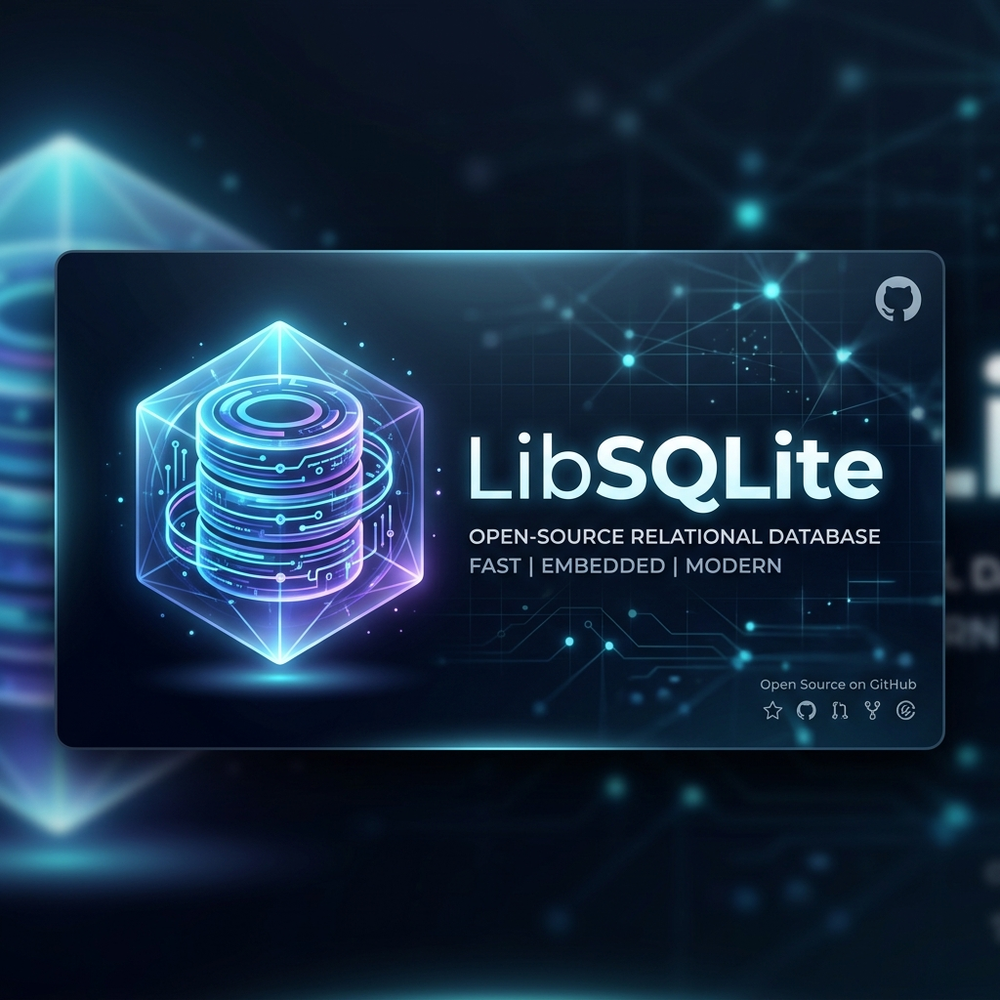
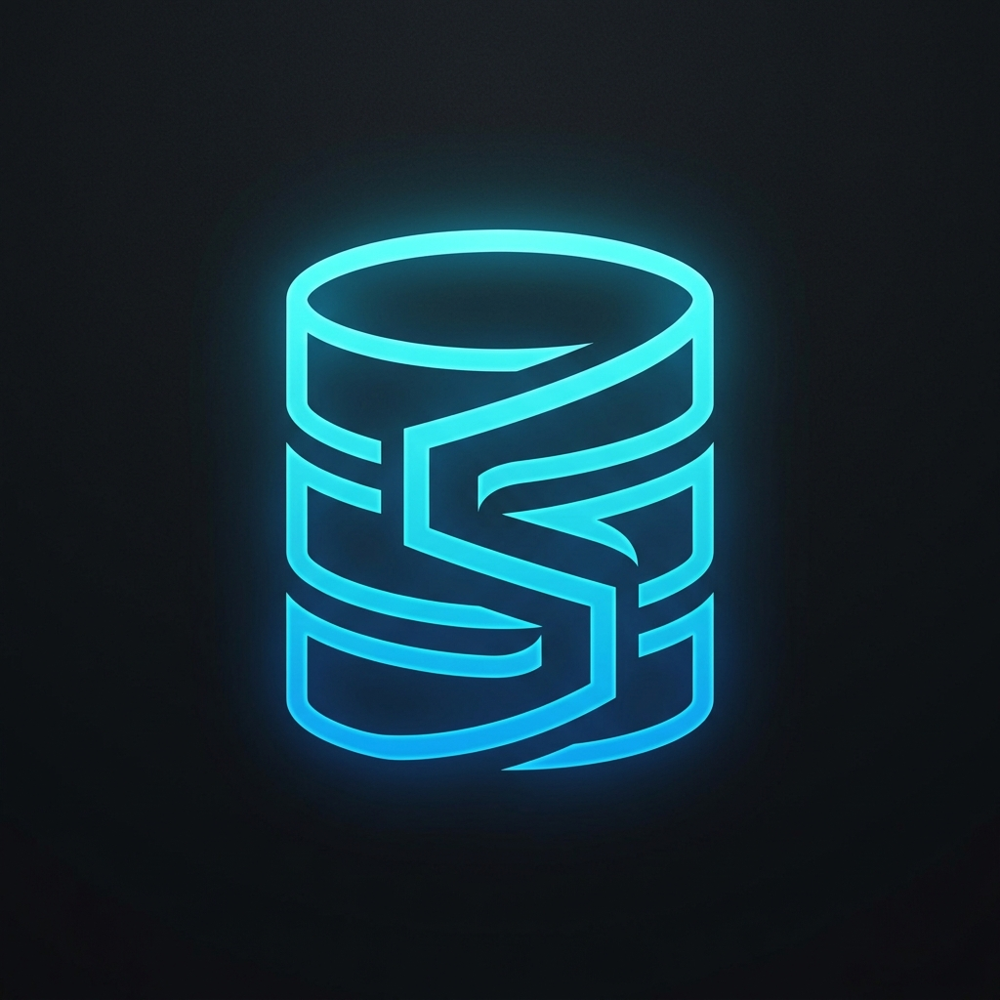

<div align="center">
  
  <br />
  

  # LibSQLite

  **The self-hosted, Turso-like control plane for SQLite & libSQL.**

  <p>
    <a href="#features">Features</a> •
    <a href="#quick-start">Quick Start</a> •
    <a href="#documentation">Documentation</a> •
    <a href="#architecture">Architecture</a>
  </p>

  <p>
    
    
    
    
    
  </p>
</div>

---

## What is LibSQLite?

LibSQLite brings the modern developer experience of serverless databases to your own infrastructure. It is a comprehensive **database management platform** designed to orchestrate and interface with SQLite and libSQL files.

Whether you want to manage local `.db` files or connect to remote libSQL edge nodes, LibSQLite provides a beautiful, secure, and intuitive web panel to govern your entire data plane.

<br>

## Key Features

- **Unified Management Panel**: Govern multiple SQLite databases from an intuitive, unified dashboard.
- **libSQL Remote Ready**: Native support for registering and managing libSQL remote databases via secure tokens.
- **Auto-Discovery & Import**: Effortlessly discover `.db` files mounted from your server or import existing ones.
- **Built-in Studio**: Powerful schema browsing, data visualization, and raw query execution built right into the interface.
- **Migration Engine**: Apply, track, and execute safe migrations directly from code, CI/CD, or the API.
- **Enterprise-Grade Security**: Full RBAC, encrypted token storage, comprehensive audit logging, and `HttpOnly` session hardening.
- **Deploy Anywhere**: First-class support for local servers, VPS, and zero-config deployment on **Coolify** using Docker.

<br>

## Quick Start

Get up and running with LibSQLite in seconds using Docker Compose or Node.js.

### Option A: Running with Docker (Recommended)

LibSQLite ships with a robust `docker-compose.yml` for effortless production or local deployment.

```bash
# Start the entire stack (Backend on port 5000, Frontend on 5001)
docker-compose up -d --build
```
> The backend automatically generates and persists a secure `MASTER_KEY` if none is supplied. 

### Option B: Local Development

```bash
# 1. Install backend dependencies and configure env
cd backend
npm install
cp .env.example .env

# 2. Build and start the backend service
npm run build
npm run start

# 3. In a new terminal, start the Next.js frontend
cd ../frontend
npm install
npm run dev
```

<br>

## Architecture Overview

At its core, LibSQLite enforces a strict separation between the **Control Plane** (Backend metadata and management) and the **Data Plane** (Actual SQLite/libSQL files).

```mermaid
graph TD;
    A[Frontend Panel / Studio] -->|Proxy API over HTTPs| B(Backend Control Plane);
    B -->|TypeORM| C[(control.db - Metadata)];
    B -->|@libsql/client| D[(Local SQLite Files)];
    B -->|@libsql/client| E((Remote libSQL Nodes));
```

**Storage Layout**
Managed SQLite files are securely structured within your storage root (configurable via `SQLITE_STORAGE_ROOT`):
```text
data/sqlite/projects/<projectId>/databases/<databaseId>.db
```

<br>

## Documentation

Deep-dive into our extensive guides to master your self-hosted infrastructure:

| Getting Started | Operations | Architecture |
| :--- | :--- | :--- |
| [Usage Guide](docs/USAGE.md) | [Production Guide](docs/PRODUCTION.md) | [Architecture](docs/ARCHITECTURE.md) |
| [Development Guide](docs/DEVELOPMENT.md) | [Security Guide](docs/SECURITY.md) | [API Reference](docs/API.md) |
| [Deployment Guide](docs/DEPLOYMENT.md) | [Coolify Guide](COOLIFY.md) | [Operations Manual](docs/OPERATIONS.md) |
| [Deploy Checklist](DEPLOYMENT_CHECKLIST.md) | [Troubleshooting](docs/TROUBLESHOOTING.md) | |

<br>

## Tech Stack

- **Frontend**: Next.js 14+ (App Router), React, Tailwind CSS, Lucide Icons.
- **Backend**: Node.js, Fastify, TypeORM, `@libsql/client`.
- **Security**: Argon2 Encryption, Helmet, Rate-Limiting.
- **Infrastructure**: Docker, Coolify.

<br>

---

<div align="center">
  Built for developers who demand control over their data.<br>
  Created by <b><a href="https://joshuachavez.vercel.app" target="_blank">Joshua Chávez Lau</a></b><br><br>
  <b><a href="#">Report Bug</a></b> • <b><a href="#">Request Feature</a></b>
</div>
