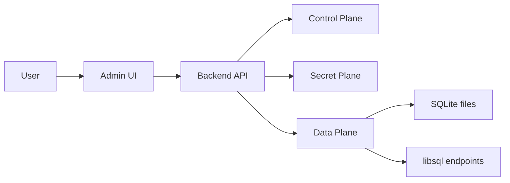

# Architecture

## Purpose

libsqlite is a self-hosted control plane for SQLite and libsql databases. It is intended for local servers, VPS deployments and Coolify-based hosting.

The design follows clear separation between domain logic, application orchestration, infrastructure and presentation.

## System view



## Main planes

### Control Plane

Stores metadata about:

- users
- roles and permissions
- projects
- databases
- sessions
- audit logs
- migration history

### Data Plane

Stores or accesses the actual database workload:

- managed SQLite files
- imported SQLite files
- mounted SQLite files discovered on disk
- remote libsql databases

### Secret Plane

Stores sensitive values encrypted with `MASTER_KEY`:

- database tokens
- connection credentials
- future secret material if a vault integration is added

## DDD layers

### Domain

Pure business rules and entities.

Examples:

- `User`
- `Project`
- `Database`
- `Role`
- `Permission`
- `Session`
- `AuditLog`
- `DatabaseMigration`

### Application

Use cases and orchestration.

Examples:

- authentication workflows
- project creation
- database provisioning
- SQLite discovery and adoption
- migration application
- query execution

### Infrastructure

Concrete adapters and integrations.

Examples:

- TypeORM data source
- SQLite file access (with robust `DatabaseError` classification and integrity checks)
- libsql client (with remote fallback handling)
- AES-GCM encryption
- token hashing
- storage layout service

### Presentation

HTTP controllers, request guards and plugins.

Examples:

- auth routes
- project routes
- database routes
- migration routes
- discovery routes
- health routes

## Data flow

### Create a new SQLite database

1. User creates a project.
2. User requests a new SQLite database.
3. The backend creates metadata in the control plane.
4. The backend creates a file in the structured storage tree.
5. The database is marked active and returned to the user.

### Import an existing SQLite database

1. User provides a server-side `.db` path.
2. The backend copies the file into managed storage.
3. Metadata is saved and the database becomes manageable.

### Discover mounted SQLite files

1. User configures a discovery directory.
2. The backend scans for `.db` files.
3. Each file is registered in the control plane.
4. Optionally, the file is adopted into managed storage.

### Manage libsql remote databases

1. User registers URL and token.
2. The backend encrypts the token.
3. The backend verifies connectivity.
4. Queries and schema introspection use the registered connection.

## Storage layout

Managed SQLite files are written using a structured hierarchy:

```text
data/sqlite/projects/<projectId>/databases/<databaseId>.db
```

This keeps the filesystem predictable and easy to back up.

## Why this structure is scalable

- the control plane is independent from the data plane
- database records are isolated by project and database identifier
- secret handling is centralized
- storage paths are deterministic
- the backend can be deployed the same way on local machines, VPS or Coolify

## Stability and Resiliency

To prevent data corruption and application crashes:

- **Error Classification**: All database errors are wrapped in a generic `DatabaseError` structure to safely distinguish `SQLITE_CORRUPT`, `SQLITE_BUSY`, constraints, and syntax errors, bubbling up meaningful HTTP codes.
- **Migration Atomicity**: Local SQLite migrations are enclosed in `BEGIN` ... `COMMIT` / `ROLLBACK` transactions to ensure partial migrations do not leave databases in a broken state.
- **Integrity Checks**: `PRAGMA integrity_check` is automatically validated when a database connection is tested, immediately alerting if underlying disk files are corrupt.
